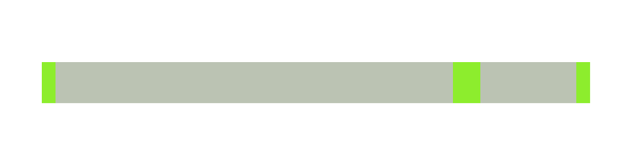
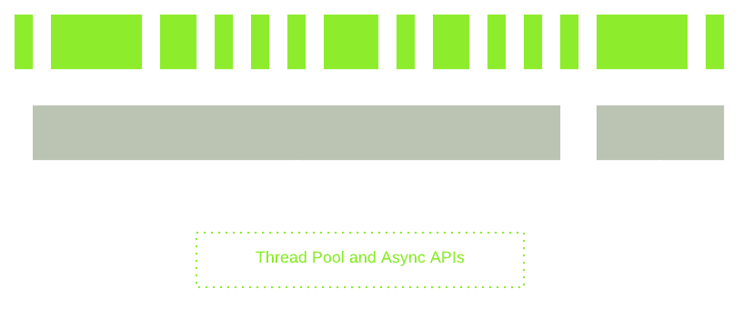

I/O latency
========
<table>
    <tr>
        <td>L1 cache</td>
        <td>3 <span style="font-size: 50%;">CPU cycles</span></td>
    </tr>
    <tr>
        <td>L2 cache</td>
        <td>14 <span style="font-size: 50%;">CPU cycles</span></td>
    </tr>
    <tr>
        <td>RAM</td>
        <td>250 <span style="font-size: 50%;">CPU cycles</span></td>
    </tr>
    <tr>
        <td>Disk</td>
        <td>41,000,000 <span style="font-size: 50%;">CPU cycles</span></td>
    </tr>
    <tr>
        <td>Network</td>
        <td>240,000,000 <span style="font-size: 50%;">CPU cycles</span></td>
    </tr>
</table>

Standard flow
---


Scaling with threads
---


- Context switch overhead
- Execution stack take up memory
- Complicated

How about split this up?
---


Scaling with event loop
---


Event loop
---
```
   ┌───────────────────────┐
┌─>│        timers         │
│  └──────────┬────────────┘
│  ┌──────────┴────────────┐
│  │     I/O callbacks     │
│  └──────────┬────────────┘
│  ┌──────────┴────────────┐
│  │     idle, prepare     │
│  └──────────┬────────────┘      ┌───────────────┐
│  ┌──────────┴────────────┐      │   incoming:   │
│  │         poll          │<─────┤  connections, │
│  └──────────┬────────────┘      │   data, etc.  │
│  ┌──────────┴────────────┐      └───────────────┘
│  │        check          │
│  └──────────┬────────────┘
│  ┌──────────┴────────────┐
└──┤    close callbacks    │
   └───────────────────────┘
```

Examples
---
- [Simple Example](http://latentflip.com/loupe/?code=JC5vbignYnV0dG9uJywgJ2NsaWNrJywgZnVuY3Rpb24gb25DbGljaygpIHsKICAgIHNldFRpbWVvdXQoZnVuY3Rpb24gdGltZXIoKSB7CiAgICAgICAgY29uc29sZS5sb2coJ1lvdSBjbGlja2VkIHRoZSBidXR0b24hJyk7ICAgIAogICAgfSwgMjAwMCk7Cn0pOwoKY29uc29sZS5sb2coIkhpISIpOwoKc2V0VGltZW91dChmdW5jdGlvbiB0aW1lb3V0KCkgewogICAgY29uc29sZS5sb2coIkNsaWNrIHRoZSBidXR0b24hIik7Cn0sIDUwMDApOwoKY29uc29sZS5sb2coIldlbGNvbWUgdG8gbG91cGUuIik7!!!PGJ1dHRvbj5DbGljayBtZSE8L2J1dHRvbj4%3D)
- [My Interview Example](http://latentflip.com/loupe/?code=c2V0VGltZW91dChmdW5jdGlvbiBzbG93KCkgewogICAgZm9yICh2YXIgaSA9IDA7IGkgPCA1OyBpKyspIHsKICAgIH0KICAgIGNvbnNvbGUubG9nKDEpOwp9LCAxKTsKCnNldFRpbWVvdXQoZnVuY3Rpb24gcXVpY2soKSB7CiAgICBjb25zb2xlLmxvZygiMiIpOwp9LCAyKTsKCmNvbnNvbGUubG9nKCIzIik7!!!PGJ1dHRvbj5DbGljayBtZSE8L2J1dHRvbj4%3D)


Materials
---
[Philip Roberts: What the heck is the event loop anyway?](https://www.youtube.com/watch?v=8aGhZQkoFbQ)